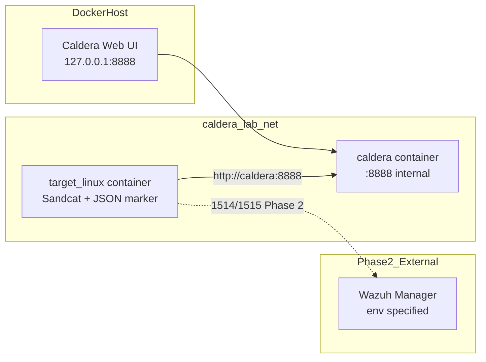

# sensel-caldera-linux-lab

Minimal SenseL / Caldera Linux training lab using two Docker containers on localhost.

## Architecture



### Network and port design

| Component | Exposure | Notes |
|-----------|----------|-------|
| `caldera` | `127.0.0.1:8888` on host | UI/C2 HTTP only on localhost |
| `target-linux` | none | reaches Caldera via Docker DNS `caldera:8888` |
| `caldera_lab_net` | bridge | isolated lab network |
| Wazuh Manager | external | configured via `.env`, not deployed here |

Security constraints enforced:

- no `privileged` mode
- no Docker socket mount
- no host root filesystem mount
- no `network_mode: host` on target
- no ngrok / cloudflared / public tunnel

## Prerequisites

- Docker Engine / Docker Desktop
- Python 3.10+ (for `trainingctl` and pytest)
- ~4 GB free disk for Caldera image build

## Quick start

```bash
cd ~/caldera_pentest/sensel-caldera-linux-lab
cp .env.example .env
make validate
make up
make status
```

Open Caldera UI: http://127.0.0.1:8888 (default login `red` / `admin` unless changed).

## Environment variables

See [`.env.example`](.env.example).

Key values:

| Variable | Default | Purpose |
|----------|---------|---------|
| `CALDERA_REF` | `5.3.0` | Caldera git tag/branch |
| `TENANT_ID` | `castle-train-01` | training tenant |
| `TARGET_AGENT_NAME` | `caldera-linux-target-01` | target hostname |
| `SANDCAT_GROUP` | `castle-train-01` | Sandcat group |
| `ENABLE_WAZUH` | `false` | Phase 1 skips Wazuh agent |
| `SANDCAT_DEPLOY_COMMAND` | empty | optional UI command override |

## Sandcat deployment mechanism

**Primary (automated):** header-based `POST /file/download` per Caldera v5.3.0 Sandcat docs:

- `file: sandcat.go`
- `platform: linux`
- `server: http://caldera:8888`
- `group: castle-train-01`

Implemented in [`scripts/bootstrap-sandcat.sh`](scripts/bootstrap-sandcat.sh).

**Fallback (manual):** copy Linux deploy command from Caldera UI into `.env`:

```bash
bash scripts/print-sandcat-deploy-command.sh
# paste into SANDCAT_DEPLOY_COMMAND=
docker compose restart target-linux
```

Reason: `/api/v2/deploy_commands` requires authenticated UI session and embeds dynamic `app.contact.http`; header-based `/file/download` is stable inside the lab network.

Reference: [Caldera 5.3.0 Sandcat Details](https://caldera.readthedocs.io/en/5.3.0/plugins/sandcat/Sandcat-Details.html)

## Wazuh agent enrollment (Phase 2)

Phase 1 runs without Wazuh agent. Enable later with `ENABLE_WAZUH=true`.

### A. Agent key mount

1. Obtain pre-shared agent key from soc-sensel Wazuh Manager.
2. Save as `./secrets/client.keys`
3. Set in `.env`:

```bash
ENABLE_WAZUH=true
WAZUH_ENROLLMENT_MODE=key_mount
WAZUH_MANAGER_HOST=<manager-host>
```

Difference: manager already knows the agent ID/key; no enrollment port call.

### B. Auto enrollment service

```bash
ENABLE_WAZUH=true
WAZUH_ENROLLMENT_MODE=auto_enroll
WAZUH_MANAGER_HOST=<manager-host>
WAZUH_ENROLLMENT_HOST=<enrollment-host>
WAZUH_ENROLLMENT_PORT=1515
```

Difference: agent calls `agent-auth` against enrollment service; manager must allow agent registration.

## Caldera UI workflow

```bash
python3 scripts/trainingctl.py run-manual
```

Summary:

1. Create adversary profile with abilities `SEN-LNX-001` .. `SEN-LNX-004`
2. Select target-linux Sandcat agent (`castle-train-01`)
3. Start operation
4. Export operation report JSON
5. Correlate with Wazuh alerts

## Safe Linux abilities

| ID | ATT&CK | Expected Wazuh rule |
|----|--------|---------------------|
| SEN-LNX-001 | T1087.001 | 100610 |
| SEN-LNX-002 | T1016 | 100611 |
| SEN-LNX-003 | T1057 | 100612 |
| SEN-LNX-004 | T1074.001 | 100613 |

Markers written to `/var/log/sensel-training/caldera-events.json` on target-linux.

## Wazuh rule deployment (soc-sensel Manager)

1. Copy [`wazuh/manager/local_rules.xml`](wazuh/manager/local_rules.xml) to manager `etc/rules/` (or merge into existing custom rules).
2. Restart Wazuh manager analysis service.
3. Validate with test events:

```bash
make wazuh-test
```

If `wazuh-logtest` is unavailable locally, use pytest fixtures:

```bash
make test
```

**Important:** fixture tests passing does **not** prove live Wazuh ingestion on your manager.

## Layer C correlation example

```bash
python3 scripts/trainingctl.py correlate \
  --operation-report fixtures/caldera-operation-report.sample.json \
  --wazuh-alerts fixtures/wazuh-alerts.ndjson
```

Output:

- `reports/SEN-APT29-LNX-01-correlation.json`
- `reports/SEN-APT29-LNX-01-summary.md`

Correlation keys: `tenant_id + hostname + scenario_id + time window`. `operation_id` is added by backend correlation, not by abilities.

## Makefile targets

| Target | Description |
|--------|-------------|
| `make up` | build and start lab |
| `make status` | compose ps + trainingctl status |
| `make test` | pytest |
| `make wazuh-test` | wazuh-logtest against rule fixtures |
| `make validate` | trainingctl validate + compose config |
| `make clean` | cleanup staging/sandcat and remove volumes |

## Cleanup and troubleshooting

```bash
python3 scripts/trainingctl.py cleanup
make down
```

| Issue | Check |
|-------|-------|
| Sandcat not appearing | `docker compose logs target-linux`; verify `curl http://caldera:8888/api/v2/health` from target |
| Caldera slow start | first run builds UI/agents; wait for healthcheck |
| Abilities missing | ensure `sensel` plugin loaded; restart caldera |
| Wazuh rules not firing | confirm manager has `local_rules.xml`; agent not running in Phase 1 |

## Limitations

In a non-privileged Docker container, full native process/audit telemetry is not guaranteed. This lab validates the chain using:

- Caldera command results
- JSON training markers
- Wazuh JSON log + FIM ingestion (Phase 2)

For native Linux auditd / Sysmon-like process telemetry, use a VM or dedicated sensor.

## Project layout

```
caldera/                  Caldera server image build
target-linux/             Target container (Sandcat + marker writer)
caldera-plugin-sensel/    Four safe Linux abilities
wazuh/                    Agent fragment + manager rules + test events
training/scenarios/       Scenario definition
scripts/                  trainingctl, bootstrap, correlation
tests/                    pytest suite
fixtures/                 sample alerts and operation report
```
