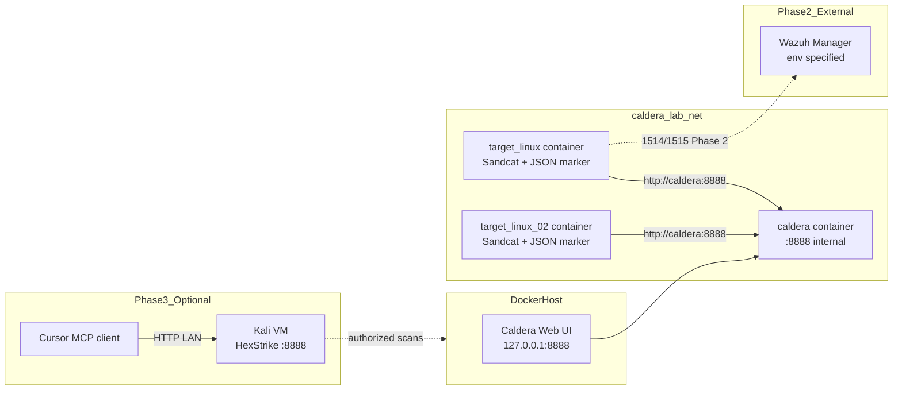

# sensel-caldera-linux-lab

Minimal SenseL / Caldera Linux training lab using two Docker containers on localhost.

**Training Guide 2.0:** [training/TRAINING-GUIDE-2.0.md](training/TRAINING-GUIDE-2.0.md) — four scenarios, nineteen safe abilities, Chain C dual-target simulated lateral.

## Architecture



### Network and port design

| Component | Exposure | Notes |
|-----------|----------|-------|
| `caldera` | `127.0.0.1:8888` on host | UI/C2 HTTP only on localhost |
| `target-linux` | none | reaches Caldera via Docker DNS `caldera:8888` |
| `target-linux-02` | none | Chain C tier-2 file server; same network |
| `caldera_lab_net` | bridge | isolated lab network |
| Wazuh Manager | external | configured via `.env`, not deployed here |

Security constraints enforced:

- no `privileged` mode
- no Docker socket mount
- no host root filesystem mount
- no `network_mode: host` on target
- no ngrok / cloudflared / public tunnel

## Prerequisites

- Docker Engine / Docker Desktop
- Python 3.10+ (for `trainingctl` and pytest)
- ~4 GB free disk for Caldera image build

## Quick start

```bash
cd ~/caldera_pentest/sensel-caldera-linux-lab
cp .env.example .env
make validate
make up
make status
```

Open Caldera UI: http://127.0.0.1:8888 (default login `red` / `admin` unless changed).

## Environment variables

See [`.env.example`](.env.example).

Key values:

| Variable | Default | Purpose |
|----------|---------|---------|
| `CALDERA_REF` | `5.3.0` | Caldera git tag/branch |
| `TENANT_ID` | `castle-train-01` | training tenant |
| `TARGET_AGENT_NAME` | `caldera-linux-target-01` | primary target hostname |
| `TARGET_AGENT_NAME_02` | `caldera-linux-target-02` | Chain C tier-2 target hostname |
| `SANDCAT_GROUP` | `castle-train-01` | Sandcat group |
| `ENABLE_WAZUH` | `false` | Phase 1 skips Wazuh agent |
| `ENABLE_HEXSTRIKE` | `false` | Phase 3 flag (MCP + Kali, optional) |
| `HEXSTRIKE_SERVER_URL` | `http://192.168.1.110:8888` | Kali HexStrike server |
| `SANDCAT_DEPLOY_COMMAND` | empty | optional UI command override |

## Sandcat deployment mechanism

**Primary (automated):** header-based `POST /file/download` per Caldera v5.3.0 Sandcat docs:

- `file: sandcat.go`
- `platform: linux`
- `server: http://caldera:8888`
- `group: castle-train-01`

Implemented in [`scripts/bootstrap-sandcat.sh`](scripts/bootstrap-sandcat.sh).

**Fallback (manual):** copy Linux deploy command from Caldera UI into `.env`:

```bash
bash scripts/print-sandcat-deploy-command.sh
# paste into SANDCAT_DEPLOY_COMMAND=
docker compose restart target-linux
```

Reason: `/api/v2/deploy_commands` requires authenticated UI session and embeds dynamic `app.contact.http`; header-based `/file/download` is stable inside the lab network.

Reference: [Caldera 5.3.0 Sandcat Details](https://caldera.readthedocs.io/en/5.3.0/plugins/sandcat/Sandcat-Details.html)

## Wazuh agent enrollment (Phase 2)

Phase 1 runs without Wazuh agent. Enable later with `ENABLE_WAZUH=true`.

### A. Agent key mount

1. Obtain pre-shared agent key from soc-sensel Wazuh Manager.
2. Save as `./secrets/client.keys`
3. Set in `.env`:

```bash
ENABLE_WAZUH=true
WAZUH_ENROLLMENT_MODE=key_mount
WAZUH_MANAGER_HOST=<manager-host>
```

Difference: manager already knows the agent ID/key; no enrollment port call.

### B. Auto enrollment service

```bash
ENABLE_WAZUH=true
WAZUH_ENROLLMENT_MODE=auto_enroll
WAZUH_MANAGER_HOST=<manager-host>
WAZUH_ENROLLMENT_HOST=<enrollment-host>
WAZUH_ENROLLMENT_PORT=1515
```

Difference: agent calls `agent-auth` against enrollment service; manager must allow agent registration.

## HexStrike MCP + Kali (Phase 3)

Optional third stage: Cursor drives **HexStrike AI** on a Kali VM (`192.168.1.110` by default) while Phase 1/2 Docker lab keeps running on localhost.

Full guide: [docs/PHASE3-HEXSTRIKE.md](docs/PHASE3-HEXSTRIKE.md).

```bash
# 1. On Kali: install and start hexstrike_server.py (see docs/PHASE3-HEXSTRIKE.md)
# 2. On Mac: set HEXSTRIKE_* in .env, then:
make hexstrike-mcp      # writes .cursor/mcp.json (gitignored)
make hexstrike-check    # ping + /health
# 3. Reload Cursor → Settings → MCP → hexstrike-ai connected
```

Split-host model: **tool server on Kali**, **MCP client in Cursor on Mac**. Caldera stays on `127.0.0.1:8888`; HexStrike on Kali uses LAN `:8888` — no port clash.

## Caldera UI workflow

Full instructor steps: [training/TRAINING-GUIDE-2.0.md](training/TRAINING-GUIDE-2.0.md).

```bash
# Intro scenario (4 abilities)
python3 scripts/trainingctl.py run-manual --scenario SEN-APT29-LNX-01

# Chain A — discovery, staging, archive (6 abilities)
python3 scripts/trainingctl.py run-manual --scenario SEN-APT29-LNX-02

# Chain B — auto-collect, simulated exfil prep (6 abilities)
python3 scripts/trainingctl.py run-manual --scenario SEN-APT29-LNX-03

# Chain C — dual-target simulated lateral (8 abilities, select BOTH agents)
python3 scripts/trainingctl.py run-manual --scenario SEN-APT29-LNX-04
```

Summary:

1. Create adversary profile (`SEN-LNX-Chain-Intro`, `SEN-LNX-Chain-A`, `SEN-LNX-Chain-B`, or `SEN-LNX-Chain-C`)
2. Add abilities **in order** — do **not** use empty ad-hoc profile
3. Select Sandcat agent(s) (`castle-train-01`; Chain C requires **both** targets)
4. Start operation with Autonomous ON
5. Export operation report JSON
6. Correlate with Wazuh alerts

## Training scenarios (v2.0)

| Scenario ID | Profile name | Steps | Focus |
|-------------|--------------|-------|-------|
| `SEN-APT29-LNX-01` | `SEN-LNX-Chain-Intro` | 4 | Discovery + staging intro |
| `SEN-APT29-LNX-02` | `SEN-LNX-Chain-A` | 6 | Discovery → staging → tar archive |
| `SEN-APT29-LNX-03` | `SEN-LNX-Chain-B` | 6 | Identity/service discovery → auto-collect → simulated exfil size |
| `SEN-APT29-LNX-04` | `SEN-LNX-Chain-C` | 8 | Dual-target simulated lateral → tier-2 staging → archive → sim exfil |

## Safe Linux abilities

| ID | ATT&CK | Tactic | Expected Wazuh rule |
|----|--------|--------|---------------------|
| SEN-LNX-001 | T1087.001 | Discovery | 100610 |
| SEN-LNX-002 | T1016 | Discovery | 100611 |
| SEN-LNX-003 | T1057 | Discovery | 100612 |
| SEN-LNX-004 | T1074.001 | Collection | 100613 |
| SEN-LNX-005 | T1082 | Discovery | 100614 |
| SEN-LNX-006 | T1083 | Discovery | 100615 |
| SEN-LNX-007 | T1560.001 | Collection | 100616 |
| SEN-LNX-008 | T1033 | Discovery | 100617 |
| SEN-LNX-009 | T1007 | Discovery | 100618 |
| SEN-LNX-010 | T1119 | Collection | 100619 |
| SEN-LNX-011 | T1030 | Exfiltration (simulated) | 100620 |
| SEN-LNX-012 | T1018 | Discovery | 100627 |
| SEN-LNX-013 | T1046 | Discovery | 100628 |
| SEN-LNX-014 | T1018 | Discovery (simulated lateral plan) | 100629 |
| SEN-LNX-015 | T1082 | Discovery | 100630 |
| SEN-LNX-016 | T1083 | Discovery | 100631 |
| SEN-LNX-017 | T1074.001 | Collection | 100632 |
| SEN-LNX-018 | T1560.001 | Collection | 100633 |
| SEN-LNX-019 | T1030 | Exfiltration (simulated) | 100634 |

SEN-LNX-011 and SEN-LNX-019 perform **local byte counting only** — no network exfiltration. Chain C uses **simulated lateral planning** — no SSH pivot or remote execution.

Markers written to `/var/log/sensel-training/caldera-events.json` on target-linux.

## Wazuh rule deployment (soc-sensel Manager)

1. Copy [`wazuh/manager/local_rules.xml`](wazuh/manager/local_rules.xml) to manager `etc/rules/` (or merge into existing custom rules).
2. Restart Wazuh manager analysis service.
3. Validate with test events:

```bash
make wazuh-test
```

If `wazuh-logtest` is unavailable locally, use pytest fixtures:

```bash
make test
```

**Important:** fixture tests passing does **not** prove live Wazuh ingestion on your manager.

## Layer C correlation example

```bash
python3 scripts/trainingctl.py correlate \
  --scenario SEN-APT29-LNX-01 \
  --operation-report fixtures/caldera-operation-report.sample.json \
  --wazuh-alerts fixtures/wazuh-alerts.ndjson
```

Output (per scenario):

- `reports/SEN-APT29-LNX-01-correlation.json`
- `reports/SEN-APT29-LNX-01-summary.md`

Correlation keys: `tenant_id + hostname + scenario_id + time window`. `operation_id` is added by backend correlation, not by abilities.

## Makefile targets

| Target | Description |
|--------|-------------|
| `make up` | build and start lab |
| `make status` | compose ps + trainingctl status |
| `make test` | pytest |
| `make wazuh-test` | wazuh-logtest against rule fixtures |
| `make validate` | trainingctl validate + compose config |
| `make hexstrike-mcp` | generate `.cursor/mcp.json` from `.env` (Phase 3) |
| `make hexstrike-check` | ping Kali + HexStrike `/health` |
| `make clean` | cleanup staging/sandcat and remove volumes |

## Cleanup and troubleshooting

```bash
python3 scripts/trainingctl.py cleanup
make down
```

| Issue | Check |
|-------|-------|
| Sandcat not appearing | `docker compose logs target-linux`; verify `curl http://caldera:8888/api/v2/health` from target |
| Caldera slow start | first run builds UI/agents; wait for healthcheck |
| Abilities missing | ensure `sensel` plugin loaded; restart caldera |
| Wazuh rules not firing | confirm manager has `local_rules.xml`; agent not running in Phase 1 |

## Limitations

In a non-privileged Docker container, full native process/audit telemetry is not guaranteed. This lab validates the chain using:

- Caldera command results
- JSON training markers
- Wazuh JSON log + FIM ingestion (Phase 2)
- HexStrike MCP on Kali for AI-assisted recon against authorized lab targets (Phase 3)

For native Linux auditd / Sysmon-like process telemetry, use a VM or dedicated sensor.

## Project layout

```
caldera/                  Caldera server image build
target-linux/             Target container (Sandcat + marker writer)
caldera-plugin-sensel/    Eleven safe Linux abilities (SEN-LNX-001..011)
wazuh/                    Agent fragment + manager rules + test events
training/                 Scenario definitions + TRAINING-GUIDE-2.0.md
scripts/                  trainingctl, bootstrap, correlation, hexstrike MCP
scripts/kali/             Kali-side HexStrike server setup (Phase 3)
docs/                     PHASE3-HEXSTRIKE.md
tests/                    pytest suite
fixtures/                 sample alerts and operation report
```
