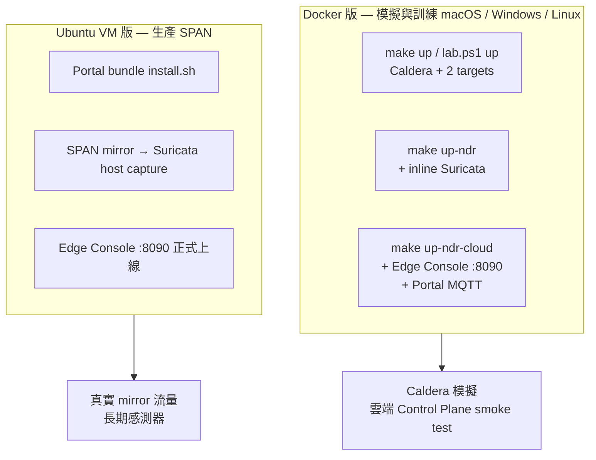
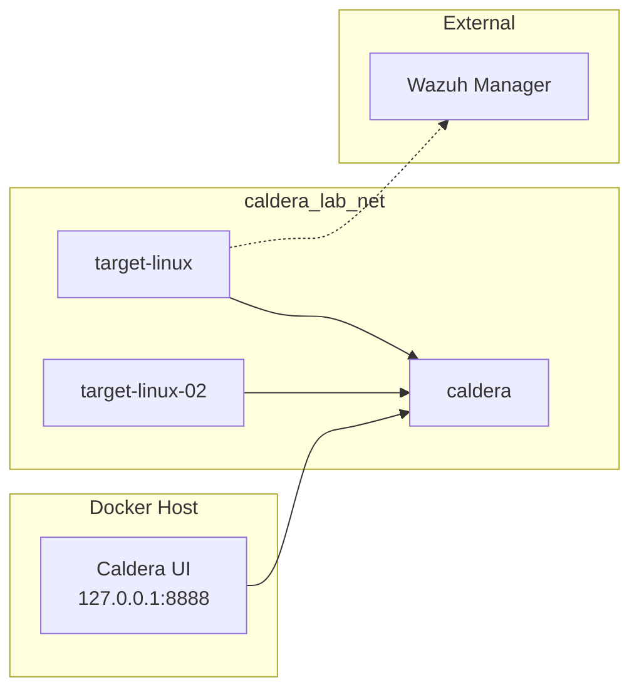
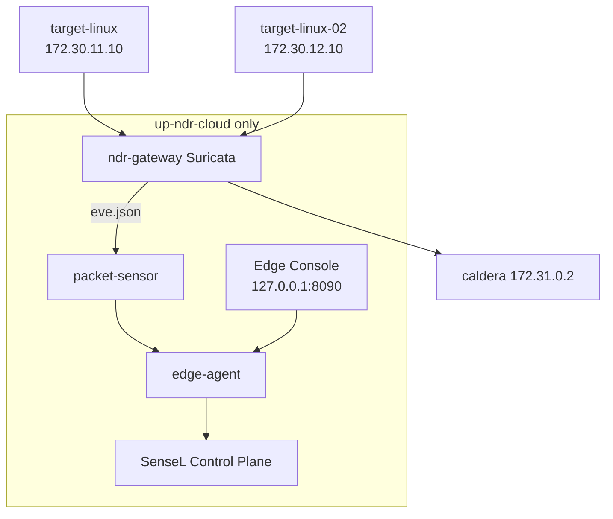

# sensel-caldera-linux-lab

SenseL 安全訓練實驗室：在 **localhost Docker** 上運行 [MITRE Caldera](https://github.com/mitre/caldera) 5.3.0，搭配可選 **Wazuh EDR**、**Suricata NDR**，以及 **SenseL Control Plane** 雲端報到。

**Training Guide 2.1：** [training/TRAINING-GUIDE-2.1.md](training/TRAINING-GUIDE-2.1.md)（PDF：[training/pdf/README.md](training/pdf/README.md)）  
**Training Guide 2.0（舊版）：** [training/TRAINING-GUIDE-2.0.md](training/TRAINING-GUIDE-2.0.md)

| 平台 | 快速開始 |
|------|----------|
| **macOS / Linux** | `make up` → `make up-ndr` → `make up-ndr-cloud` |
| **Windows** | [docs/WINDOWS-DEPLOY.md](docs/WINDOWS-DEPLOY.md) — `.\scripts\windows\lab.ps1 up-ndr-cloud` |
| **Ubuntu VM（SPAN 正式 NDR）** | Portal bundle + [scripts/setup-ndr-edge.sh](scripts/setup-ndr-edge.sh) |

---

## 這個 repo 做什麼？

| 層級 | 元件 | 用途 |
|------|------|------|
| **攻擊模擬** | Caldera + Sandcat | 19 個安全 Linux 能力（SEN-LNX-001..019） |
| **主機偵測 (EDR)** | Wazuh Agent → Manager | Phase 2：ability 與規則 1:1（100610–100634） |
| **網路偵測 (NDR)** | Suricata + SenseL Edge | C2 beacon、ICMP 探測、橫向流量等 |
| **關聯分析** | `trainingctl correlate` | Caldera × Wazuh × Suricata 三層對照 |

所有演練在 **localhost / 隔離 Docker 網路** 內進行，不含真實外洩、提權 exploit 或橫向 pivot。

---

## SenseL OT NDR vs IT NDR

兩者皆基於上游 [sensel-ot-edge-sensor](https://github.com/AvocadoAI-Lab/sensel-ot-edge-sensor)（Suricata / packet-sensor / edge-agent）。差異在 **部署場景** 與 **profile**：

| | **OT NDR** | **IT NDR**（本 lab 預設） |
|---|-----------|--------------------------|
| **典型環境** | 工控 / OT 網段、OpenWrt、SPAN mirror | 企業 IT、Ubuntu 感測器、VMware/實體 SPAN |
| **Profile** | `ot_ids` | `it_ndr` |
| **Portal bundle** | OT Edge 下載包 | `sensel-it-ndr-company-*` |
| **流量來源** | 實體 mirror（GOOSE/MMS/Modbus 等） | SPAN/TAP + HTTP/C2/ICMP 等 IT 規則 |
| **本 repo** | 可經 Portal 在 Ubuntu 部署 | **內建** inline 規則 SID 9000010–9000020 |

產品級 OT/IT 部署細節見 edge repo 的 [README](https://github.com/AvocadoAI-Lab/sensel-ot-edge-sensor) 與 `docs/deployment-*.md`。

---

## 部署模式：該選哪一種？


```mermaid
flowchart TB
  subgraph docker [Docker 版 — 模擬與訓練 macOS / Windows / Linux]
    D1["make up / lab.ps1 up\nCaldera + 2 targets"]
    D2["make up-ndr\n+ inline Suricata"]
    D3["make up-ndr-cloud\n+ Edge Console :8090\n+ Portal MQTT"]
  end
  subgraph ubuntu [Ubuntu VM 版 — 生產 SPAN]
    U1["Portal bundle install.sh"]
    U2["SPAN mirror → Suricata host capture"]
    U3["Edge Console :8090 正式上線"]
  end
  docker --> SIM["Caldera 模擬\n雲端 Control Plane smoke test"]
  ubuntu --> PROD["真實 mirror 流量\n長期感測器"]
```

### Docker 版（**推薦：Caldera 模擬與教學**）

| 模式 | 指令（Mac/Linux） | Windows |
|------|-------------------|---------|
| 基礎 lab | `make up` | `.\scripts\windows\lab.ps1 up` |
| 本機 NDR | `make up-ndr` | `.\scripts\windows\lab.ps1 up-ndr` |
| NDR + 雲端 | `make up-ndr-cloud` | `.\scripts\windows\lab.ps1 up-ndr-cloud` |

**適合：**

- **Caldera 攻擊模擬**：target 流量經 `ndr-gateway` inline 轉發
- **macOS / Windows Docker Desktop**：本機教學、pytest、關聯報告
- **雲端整合測試**：http://127.0.0.1:8090 貼 Portal invite code

**限制：** 非 SPAN 被動抓包；Desktop 版僅 smoke test，非正式 NDR 感測器。

> Windows 詳細步驟：[docs/WINDOWS-DEPLOY.md](docs/WINDOWS-DEPLOY.md)（需 Docker Desktop **Linux containers** + Git Bash）

### Ubuntu VM 版（**推薦：正式 SPAN NDR**）

```bash
# Ubuntu 22.04 / 24.04
python3 -m zipfile -e sensel-it-ndr-*.zip sensel-deploy
cd sensel-deploy && chmod +x install.sh
# 編輯 .env：SENSOR_ID、OT_REGISTRATION_TOKEN
./install.sh
# Edge Console: http://<vm-ip>:8090
```

或從本 repo：

```bash
cp /path/to/portal-bundle/.env ndr/portal.env
SENSEL_NDR_BUNDLE_DIR=/path/to/portal-bundle bash scripts/setup-ndr-edge.sh
```

NDR 技術細節：[ndr/README.md](ndr/README.md)

---

## 架構

### 基礎 lab


```mermaid
flowchart LR
  subgraph host [Docker Host]
    UI["Caldera UI\n127.0.0.1:8888"]
  end
  subgraph net [caldera_lab_net]
    C[caldera]
    T[target-linux]
    T2[target-linux-02]
  end
  subgraph ext [External]
    WM[Wazuh Manager]
  end
  UI --> C
  T --> C
  T2 --> C
  T -.-> WM
```

### NDR inline lab（`up-ndr` / `up-ndr-cloud`）


```mermaid
flowchart TB
  T1["target-linux\n172.30.11.10"] --> NDR["ndr-gateway Suricata"]
  T2["target-linux-02\n172.30.12.10"] --> NDR
  NDR --> C2["caldera 172.31.0.2"]
  subgraph cloud [up-ndr-cloud only]
    PS[packet-sensor]
    EA[edge-agent]
    EC["Edge Console\n127.0.0.1:8090"]
    CP[SenseL Control Plane]
    NDR -->|eve.json| PS --> EA --> CP
    EC --> EA
  end
```

### 網路與埠口

| 元件 | 暴露 | 說明 |
|------|------|------|
| `caldera` | `127.0.0.1:8888` | UI / C2（僅 localhost） |
| `edge-console` | `127.0.0.1:8090` | NDR Setup / invite code（`up-ndr-cloud`） |
| `target-linux` / `02` | 無 | 經 NDR 閘道路由 |
| Wazuh Manager | 外部 | `.env` 指定 |

**安全約束：** target 無 `privileged`、無 Docker socket、無 host network；edge 的 docker.sock 僅限 NDR 管理元件。

---

## Quick start

### macOS / Linux

```bash
git clone https://github.com/ericmao/sensel-caldera-linux-lab.git
cd sensel-caldera-linux-lab
cp .env.example .env
make validate && make up && make status
```

### Windows

```powershell
git clone https://github.com/ericmao/sensel-caldera-linux-lab.git
cd sensel-caldera-linux-lab
copy .env.example .env
.\scripts\windows\lab.ps1 validate
.\scripts\windows\lab.ps1 up-ndr-cloud
```

Caldera UI：http://127.0.0.1:8888（預設 `red` / `admin`）

### NDR 訓練（需先 `up-ndr` 或 `up-ndr-cloud`）

```bash
python3 scripts/trainingctl.py run-manual --scenario SEN-NDR-LNX-01
docker exec ndr-gateway tail -f /var/log/suricata/eve.json
```

雲端註冊：複製 Portal `.env` → `ndr/portal.env` → `make up-ndr-cloud` → http://127.0.0.1:8090

---

## 訓練場景

| Scenario ID | Profile | 步數 | 重點 |
|-------------|---------|------|------|
| `SEN-APT29-LNX-01` | `SEN-LNX-Chain-Intro` | 4 | 探索 + staging 入門 |
| `SEN-APT29-LNX-02` | `SEN-LNX-Chain-A` | 6 | 探索 → staging → tar |
| `SEN-APT29-LNX-03` | `SEN-LNX-Chain-B` | 6 | 身分探索 → 模擬 exfil |
| `SEN-APT29-LNX-04` | `SEN-LNX-Chain-C` | 8 | 雙 target 模擬橫向 |
| `SEN-NDR-LNX-01` | `SEN-LNX-Chain-NDR` | 5 | NDR gateway 能力鏈 |

### SEN-NDR-LNX-01 與 Suricata SID

| SID | 觸發 |
|-----|------|
| 9000010 | Caldera C2 `/beacon`（背景） |
| 9000011 | Sandcat `POST /file/download` |
| 9000012 | 大型 C2 HTTP 上傳 |
| 9000020 | ICMP 探測（SEN-LNX-013 專屬） |

三層關聯：

```bash
python3 scripts/trainingctl.py correlate \
  --scenario SEN-NDR-LNX-01 \
  --operation-report /path/to/operation-report.json \
  --wazuh-alerts fixtures/wazuh-alerts-ndr.ndjson \
  --suricata-alerts fixtures/suricata-alerts-ndr.ndjson
```

---

## 環境變數

完整列表：[`.env.example`](.env.example)

| 變數 | 預設 | 用途 |
|------|------|------|
| `CALDERA_REF` | `5.3.0` | Caldera 版本 |
| `TENANT_ID` | `castle-train-01` | 訓練 tenant |
| `ENABLE_WAZUH` | `false` | Phase 2 Wazuh |
| `NDR_PROFILE` | `it_ndr` | NDR profile |
| `NDR_SENSOR_ID` | `caldera-lab-ndr-01` | 本機 inline NDR ID |
| `SENSOR_ID` | — | Portal sensor ID（cloud） |
| `MQTT_TENANT_ID` | — | enterprise / tenant |
| `OT_REGISTRATION_TOKEN` | — | Portal invite code |
| `SENSEL_NDR_BUNDLE_DIR` | — | Ubuntu Portal bundle 路徑 |

---

## Sandcat 部署

Primary：`POST /file/download`（header-based），見 [`scripts/bootstrap-sandcat.sh`](scripts/bootstrap-sandcat.sh)。

Fallback：Caldera UI deploy command → `SANDCAT_DEPLOY_COMMAND` in `.env`。

Reference: [Caldera 5.3.0 Sandcat](https://caldera.readthedocs.io/en/5.3.0/plugins/sandcat/Sandcat-Details.html)

---

## Wazuh（Phase 2）

Phase 1 預設關閉。啟用 `ENABLE_WAZUH=true` + `WAZUH_ENROLLMENT_MODE`（`key_mount` 或 `auto_enroll`）。

規則：[`wazuh/manager/local_rules.xml`](wazuh/manager/local_rules.xml) → soc-sensel Manager。

```bash
make wazuh-test
make test
```

---

## HexStrike MCP + Kali（Phase 3，可選）

[docs/PHASE3-HEXSTRIKE.md](docs/PHASE3-HEXSTRIKE.md)

```bash
make hexstrike-mcp
make hexstrike-check
```

---

## Caldera UI 工作流程

詳見 [training/TRAINING-GUIDE-2.1.md](training/TRAINING-GUIDE-2.1.md)。

1. 建立 adversary profile（依場景）
2. 依序加入 abilities
3. 選擇 Sandcat agent（Chain C 需兩台 target）
4. Autonomous ON 啟動 operation
5. 匯出 operation report → correlate

---

## Safe Linux abilities（摘要）

19 個能力 SEN-LNX-001..019，對應 Wazuh 100610–100634。SEN-LNX-011 / 019 僅本機 byte 計數；Chain C 為**模擬**橫向規劃，無 SSH pivot。

Markers：`/var/log/sensel-training/caldera-events.json`

完整 ATT&CK 對照見 [Training Guide 2.1](training/TRAINING-GUIDE-2.1.md)。

---

## Makefile / PowerShell 指令

| Make（Mac/Linux） | Windows PowerShell |
|-------------------|---------------------|
| `make up` | `.\scripts\windows\lab.ps1 up` |
| `make up-ndr` | `.\scripts\windows\lab.ps1 up-ndr` |
| `make up-ndr-cloud` | `.\scripts\windows\lab.ps1 up-ndr-cloud` |
| `make down-ndr-cloud` | `.\scripts\windows\lab.ps1 down-ndr-cloud` |
| `make status-ndr-cloud` | `.\scripts\windows\lab.ps1 status-ndr-cloud` |
| `make test` | `.\scripts\windows\lab.ps1 test` |
| `make clean` | `.\scripts\windows\lab.ps1 clean` |

其他：`make validate`、`make ndr-config`、`make ndr-cloud-config`、`make hexstrike-*`

---

## 專案目錄

```
caldera/                  Caldera server image
target-linux/             Target 容器（Sandcat + marker）
caldera-plugin-sensel/    SEN-LNX-001..019 能力
ndr/                      Suricata 規則、portal.env 模板
compose.ndr.yml           inline NDR overlay
compose.ndr.cloud.yml     NDR + edge-agent + Console
scripts/windows/          Windows PowerShell 部署腳本
wazuh/                    Agent + Manager 規則
training/                 場景 YAML + TRAINING-GUIDE-2.1.md + pdf/
docs/                     WINDOWS-DEPLOY.md, PHASE3-HEXSTRIKE.md
tests/                    pytest
vendor/                   sensel-ot-edge-sensor（gitignore，首次 cloud 部署 clone）
```

---

## 限制與疑難排解

| 項目 | 說明 |
|------|------|
| Docker target | 無完整 auditd；以 marker + Wazuh/NDR 補足 |
| Docker NDR | inline 路由模擬，非 SPAN |
| Windows | 需 Linux containers + Git Bash；見 [WINDOWS-DEPLOY.md](docs/WINDOWS-DEPLOY.md) |
| Portal 無 sensor | 需 `up-ndr-cloud` + :8090 invite；`up-ndr` 不連雲 |

```bash
python3 scripts/trainingctl.py cleanup
make down          # 或 lab.ps1 down-ndr-cloud
```

| 問題 | 檢查 |
|------|------|
| Sandcat 未上線 | `docker compose logs target-linux` |
| NDR 無告警 | `make status-ndr`；`ndr-gateway` healthy |
| 8090 無法開啟 | 確認 `up-ndr-cloud` 且 `sensel-edge-console` running |

---

## 授權與上游

- [MITRE Caldera](https://github.com/mitre/caldera) — 依 upstream 授權
- [sensel-ot-edge-sensor](https://github.com/AvocadoAI-Lab/sensel-ot-edge-sensor) — Apache 2.0
- Suricata — `jasonish/suricata` 映像
