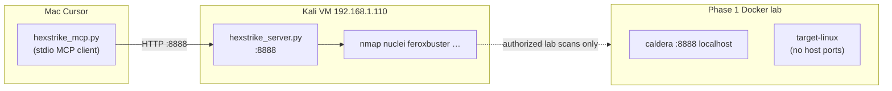

# Phase 3 — HexStrike MCP + Kali Linux

Optional third stage: connect **Cursor** to a **Kali VM** running the [HexStrike AI](https://github.com/0x4m4/hexstrike-ai) tool server via MCP. Phase 1/2 stay inside the localhost Docker lab; Phase 3 adds AI-assisted offensive tooling on an authorized lab network.

## Roadmap placement

| Phase | Focus | Where it runs |
|-------|--------|---------------|
| **1** | Caldera + Sandcat + JSON markers | Docker (`compose.yml`) |
| **2** | Wazuh agent + SOC correlation | Docker target → external Wazuh Manager |
| **3** | HexStrike MCP + 150+ pentest tools | Kali VM (tool server) + Cursor on Mac (MCP client) |

Phase 3 does **not** modify Caldera abilities or Docker compose. It is a separate validation / red-team layer you enable when the lab is running and you want Cursor to orchestrate recon or vuln scans against **authorized** targets.

## Architecture (split-host)



**Default lab URLs (from `.env`):**

- Caldera UI: `http://127.0.0.1:8888` (host-only)
- HexStrike server: `http://192.168.1.110:8888` (Kali LAN IP)

The Caldera target container has **no published ports**. From Kali you typically scan the Docker host or a bridge IP you explicitly allow — never public or production ranges.

## Prerequisites

- Phase 1 lab working (`make up`, agent visible in Caldera UI)
- Kali VM reachable on LAN (ping OK)
- SSH enabled on Kali (`sudo systemctl enable --now ssh`)
- HexStrike cloned on **both** Mac (MCP client) and Kali (tool server), or client-only on Mac if you only install server on Kali

## Step 1 — Kali: install and start HexStrike server

On the Kali VM (`192.168.1.110`, default user `kali`):

```bash
sudo apt update
sudo apt install -y python3-venv git

git clone https://github.com/0x4m4/hexstrike-ai.git ~/hexstrike-ai
cd ~/hexstrike-ai
python3 -m venv hexstrike-env
source hexstrike-env/bin/activate
pip3 install -r requirements.txt

# Run in tmux/screen so it survives logout
python3 hexstrike_server.py --host 0.0.0.0 --port 8888
```

Or use the bundled helper (copy from this repo to Kali):

```bash
bash scripts/kali/hexstrike-server-setup.sh
```

Verify from your Mac:

```bash
curl http://192.168.1.110:8888/health
make hexstrike-check
```

If the health check fails, on Kali:

```bash
sudo ufw allow 8888/tcp    # if ufw is active
sudo systemctl enable --now ssh
```

## Step 2 — Mac: HexStrike MCP client for Cursor

Clone on Mac if not already present:

```bash
git clone https://github.com/0x4m4/hexstrike-ai.git ~/hexstrike-ai
cd ~/hexstrike-ai
python3 -m venv hexstrike-env
source hexstrike-env/bin/activate
pip3 install -r requirements.txt
```

Generate project MCP config from `.env`:

```bash
cp .env.example .env   # if needed; set HEXSTRIKE_* and KALI_* values
bash scripts/setup-hexstrike-mcp.sh
```

Reload Cursor: **Cmd+Shift+P → Developer: Reload Window**, then **Settings → MCP** and confirm `hexstrike-ai` is connected.

## Step 3 — Environment variables

Add to `.env` (never commit real passwords):

```bash
ENABLE_HEXSTRIKE=true
HEXSTRIKE_SERVER_URL=http://192.168.1.110:8888
HEXSTRIKE_MCP_SCRIPT=/Users/you/hexstrike-ai/hexstrike_mcp.py
HEXSTRIKE_MCP_PYTHON=python3
KALI_HOST=192.168.1.110
KALI_SSH_USER=kali
# KALI_SSH_PASSWORD=   # local only, for one-time Kali setup via SSH
```

## Step 4 — Using Phase 3 with the Caldera lab

Suggested instructor flow after Phase 1 scenarios and (optional) Phase 2 Wazuh correlation:

1. Run a Caldera chain (e.g. `SEN-APT29-LNX-02`) and collect markers / Wazuh alerts.
2. Enable HexStrike MCP in Cursor.
3. Prompt with explicit **authorization scope**, for example:

   > I own this lab. Authorized targets: Docker host `127.0.0.1` Caldera UI port 8888 only, and LAN host running the Caldera lab. Use HexStrike for passive recon and safe discovery — no exploitation, no exfil, no brute force.

4. Compare HexStrike findings with Caldera ability output and Wazuh rules (Layer C correlation).

## Security and scope

- HexStrike can run real offensive tools. Use only on systems you own or have written permission to test.
- This repo's Docker lab rules still apply to **in-repo automation**: no credential dumping, persistence, lateral movement, or external exfil in Caldera abilities.
- Phase 3 is **operator-controlled** via Cursor; keep `alwaysAllow` empty in MCP config unless you intentionally want autonomous tool execution.
- Do not expose Kali port 8888 to the public internet; restrict to lab LAN or VPN.

## Troubleshooting

| Symptom | Fix |
|---------|-----|
| `make hexstrike-check` → connection refused | Start `hexstrike_server.py` on Kali; bind `0.0.0.0`; open firewall |
| MCP shows disconnected in Cursor | Run `scripts/setup-hexstrike-mcp.sh`; verify `HEXSTRIKE_MCP_SCRIPT` path; reload window |
| Tools time out | Increase `"timeout": 300` in `.cursor/mcp.json` |
| Kali cannot reach Docker target | Expected — target has no host ports; scan authorized host/bridge IPs only |
| Port 8888 clash with Caldera | Caldera uses host `127.0.0.1:8888`; Kali uses LAN `192.168.1.110:8888` — different interfaces |

## References

- [HexStrike AI GitHub](https://github.com/0x4m4/hexstrike-ai)
- [Caldera Training Guide 2.0](../training/TRAINING-GUIDE-2.0.md)
- Cursor MCP: project file `.cursor/mcp.json` (generated from `.cursor/mcp.json.example`)
