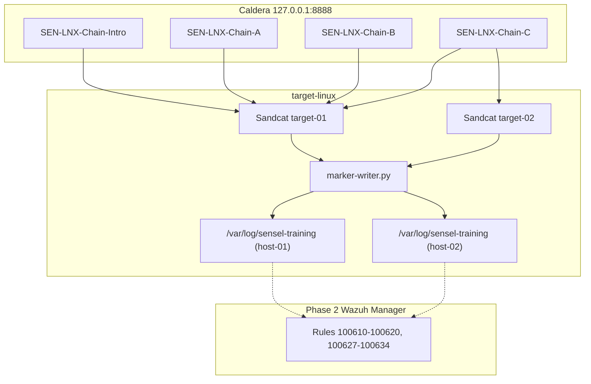

# SenseL Caldera Linux Lab — 教學指南 2.0

本文件說明 **Training Lab 2.0**：在原有 4 步 Discovery/Collection 基礎上，新增 **兩條 6 步攻擊鏈**，延伸至 ATT&CK 後段 **Collection / Archive / Simulated Exfil Prep**。

---

## 1. 版本差異

| 項目 | 1.0 | 2.0 |
|------|-----|-----|
| Abilities | 4（SEN-LNX-001～004） | 19（001～019） |
| 訓練情境 | 1 條（Intro） | 4 條（Intro + Chain A + B + C） |
| 靶機 | 1 台 target-linux | 2 台（target-01 + target-02，Chain C） |
| ATT&CK 戰術 | Discovery, Collection | + Archive, Automated Collection, Simulated Exfil, Simulated Lateral |
| Wazuh Rules | 100610～100613 | 100610～100620 + 100627～100634（Chain C） |
| 教學文件 | README 簡述 | 本指南 + README v2 章節 |

---

## 2. 安全邊界（必讀）

本 lab **禁止** 以下行為（與 1.0 相同）：

- 憑證竊取、持久化、提權、橫向移動
- 真實 outbound exfil、payload 下載、利用/反 shell
- 非 localhost 目標、privileged 容器

2.0 新增的 **SEN-LNX-011（T1030）** 與 **SEN-LNX-019（T1030）** 僅做 **本地 byte 計數**，artifact 中標記 `simulated: true`，**不會** 發送任何網路封包。

**Chain C（SEN-APT29-LNX-04）** 使用兩台靶機演練 **模擬橫向移動敘事**：在 target-01 發現 peer、寫入 lateral plan JSON，再在 target-02 執行 tier-2 收集。**兩台 agent 各自獨立回連 Caldera**，不做 SSH 跳板、遠端執行或憑證竊取。

---

## 3. 架構概覽



---

## 4. 全部 Abilities 對照表

| ID | 名稱 | ATT&CK | Tactic | Wazuh Rule |
|----|------|--------|--------|------------|
| SEN-LNX-001 | Local Account Discovery | T1087.001 | Discovery | 100610 |
| SEN-LNX-002 | Network Configuration Discovery | T1016 | Discovery | 100611 |
| SEN-LNX-003 | Process Discovery | T1057 | Discovery | 100612 |
| SEN-LNX-004 | Synthetic Data Staging | T1074.001 | Collection | 100613 |
| SEN-LNX-005 | System Information Discovery | T1082 | Discovery | 100614 |
| SEN-LNX-006 | File and Directory Discovery | T1083 | Discovery | 100615 |
| SEN-LNX-007 | Archive Staged Collection | T1560.001 | Collection | 100616 |
| SEN-LNX-008 | System Owner/User Discovery | T1033 | Discovery | 100617 |
| SEN-LNX-009 | System Service Discovery | T1007 | Discovery | 100618 |
| SEN-LNX-010 | Automated Collection | T1119 | Collection | 100619 |
| SEN-LNX-011 | Simulated Exfil Size Check | T1030 | Exfiltration* | 100620 |
| SEN-LNX-012 | Remote System Discovery | T1018 | Discovery | 100627 |
| SEN-LNX-013 | Remote Service Discovery | T1046 | Discovery | 100628 |
| SEN-LNX-014 | Simulated Lateral Plan | T1018 | Discovery* | 100629 |
| SEN-LNX-015 | Tier2 System Information Discovery | T1082 | Discovery | 100630 |
| SEN-LNX-016 | Tier2 File and Directory Discovery | T1083 | Discovery | 100631 |
| SEN-LNX-017 | Tier2 Synthetic Data Staging | T1074.001 | Collection | 100632 |
| SEN-LNX-018 | Tier2 Archive Staged Collection | T1560.001 | Collection | 100633 |
| SEN-LNX-019 | Tier2 Simulated Exfil Size Check | T1030 | Exfiltration* | 100634 |

\*T1030 在本 lab 為 **模擬**，非真實資料外傳。SEN-LNX-014 為 **模擬橫移計畫**，非真實 lateral movement。

---

## 5. 四條訓練情境

### 5.1 Intro — `SEN-APT29-LNX-01`（4 步，入門）

**Adversary profile 名稱：** `SEN-LNX-Chain-Intro`

| 步驟 | Ability | 說明 |
|------|---------|------|
| 1 | SEN-LNX-001 | 本地帳號列舉 |
| 2 | SEN-LNX-002 | 網路設定 |
| 3 | SEN-LNX-003 | 程序列表 |
| 4 | SEN-LNX-004 | Synthetic 資料 staging + manifest |

**學習目標：** Caldera operation 基本流程、JSON marker、Wazuh 關聯入門。

```bash
python3 scripts/trainingctl.py run-manual --scenario SEN-APT29-LNX-01
```

---

### 5.2 Chain A — `SEN-APT29-LNX-02`（6 步，Discovery → Staging → Archive）

**Adversary profile 名稱：** `SEN-LNX-Chain-A`

**敘事：** 攻擊者在偵察後鎖定 synthetic 訓練資料、建立 manifest，並以 tar.gz 本地打包。

| 步驟 | Ability | ATT&CK |
|------|---------|--------|
| 1 | SEN-LNX-001 | T1087.001 |
| 2 | SEN-LNX-002 | T1016 |
| 3 | SEN-LNX-005 | T1082 |
| 4 | SEN-LNX-006 | T1083 |
| 5 | SEN-LNX-004 | T1074.001 |
| 6 | SEN-LNX-007 | T1560.001 |

**Artifact 路徑：**

- `/tmp/sensel-discovery-00{1,2,5,6}.txt`
- `/tmp/sensel-training-staging/manifest.json`
- `/tmp/sensel-staging.tar.gz`

```bash
python3 scripts/trainingctl.py run-manual --scenario SEN-APT29-LNX-02
```

---

### 5.3 Chain B — `SEN-APT29-LNX-03`（6 步，Identity/Service → Auto-Collect → Simulated Exfil）

**Adversary profile 名稱：** `SEN-LNX-Chain-B`

**敘事：** 確認執行身份與服務面、自動彙整 discovery 產物、staging 後做 exfil 前 byte 計量（模擬）。

| 步驟 | Ability | ATT&CK |
|------|---------|--------|
| 1 | SEN-LNX-003 | T1057 |
| 2 | SEN-LNX-008 | T1033 |
| 3 | SEN-LNX-009 | T1007 |
| 4 | SEN-LNX-010 | T1119 |
| 5 | SEN-LNX-004 | T1074.001 |
| 6 | SEN-LNX-011 | T1030（simulated） |

**Artifact 路徑：**

- `/tmp/sensel-discovery-00{3,8,9}.txt`
- `/tmp/sensel-auto-collect/`
- `/tmp/sensel-training-staging/manifest.json`
- `/tmp/sensel-exfil-sim.json`

```bash
python3 scripts/trainingctl.py run-manual --scenario SEN-APT29-LNX-03
```

---

### 5.4 Chain C — `SEN-APT29-LNX-04`（8 步，Simulated Lateral Multi-Host）

**Adversary profile 名稱：** `SEN-LNX-Chain-C`

**敘事：** 攻擊者在 workstation（target-01）發現 tier-2 file server（target-02）、寫入模擬橫移計畫，再在 target-02 上 staging → archive → sim exfil。**兩台 agent 須同時上線。**

| 步 | Ability | 執行主機 | ATT&CK |
|----|---------|----------|--------|
| 1 | SEN-LNX-012 | target-01 | T1018 |
| 2 | SEN-LNX-013 | target-01 | T1046 |
| 3 | SEN-LNX-014 | target-01 | T1018（simulated plan） |
| 4 | SEN-LNX-015 | target-02 | T1082 |
| 5 | SEN-LNX-016 | target-02 | T1083 |
| 6 | SEN-LNX-017 | target-02 | T1074.001 |
| 7 | SEN-LNX-018 | target-02 | T1560.001 |
| 8 | SEN-LNX-019 | target-02 | T1030（simulated） |

**Artifact 路徑：**

- target-01：`/tmp/sensel-discovery-012.txt`、`013.txt`、`/tmp/sensel-lateral-plan.json`
- target-02：`/tmp/sensel-discovery-015.txt`、`016.txt`、`/tmp/sensel-training-staging/manifest.json`、`/tmp/sensel-staging-tier2.tar.gz`、`/tmp/sensel-exfil-sim-tier2.json`

```bash
python3 scripts/trainingctl.py run-manual --scenario SEN-APT29-LNX-04
```

**Caldera Operation 要點：** 勾選 **兩個 agent**（`caldera-linux-target-01` 與 `caldera-linux-target-02`）。Abilities 內建 hostname 守衛，只在對應主機執行實際動作。

---

## 6. 講師操作步驟（Caldera UI）

### 6.1 環境準備

```bash
cd ~/caldera_pentest/sensel-caldera-linux-lab
cp .env.example .env
make validate
make up
make status
```

開啟 http://127.0.0.1:8888（預設 `red` / `admin`）。

### 6.2 建立 Adversary Profile

1. **Campaigns → Adversary Profiles → + New Profile**
2. 依情境使用建議名稱（見 5.1～5.3）
3. **依序** 加入 abilities（順序錯誤會影響 atomic planner）
4. 儲存 profile

### 6.3 啟動 Operation（常見錯誤提醒）

| 設定 | 正確 | 錯誤 |
|------|------|------|
| Adversary | `SEN-LNX-Chain-A` 等具名 profile | `ad-hoc` 且未加 ability → chain 為空 |
| Agent | `caldera-linux-target-01`（Chain C 需再加 `-02`） | 無 agent 或離線 |
| Group | `castle-train-01` | 空白 |
| Autonomous | ON | OFF 時需手動逐步 |

### 6.4 驗證成功

- Operation chain 出現預期步數（4、6 或 8）
- 每步 status 為 success
- target 上 `/var/log/sensel-training/caldera-events.json` 新增 NDJSON 行

```bash
docker compose exec target-linux tail -5 /var/log/sensel-training/caldera-events.json
docker compose exec target-linux-02 tail -5 /var/log/sensel-training/caldera-events.json
```

---

## 7. Wazuh 關聯（Layer C）

### 7.1 規則部署

將 [`wazuh/manager/local_rules.xml`](../wazuh/manager/local_rules.xml) 部署至 soc-sensel Manager，重啟 analysis 服務。

本地驗證：

```bash
make wazuh-test   # 需 wazuh-logtest
make test         # pytest fixtures
```

### 7.2 關聯指令

```bash
python3 scripts/trainingctl.py correlate \
  --scenario SEN-APT29-LNX-04 \
  --operation-report /path/to/operation-report.json \
  --wazuh-alerts fixtures/wazuh-alerts-chain-c.ndjson
```

輸出：

- `reports/SEN-APT29-LNX-0{2,3,4}-correlation.json`
- `reports/SEN-APT29-LNX-0{2,3,4}-summary.md`

關聯鍵：`tenant_id` + `hostname` + `scenario_id` + 時間窗口。

---

## 8. Cleanup

```bash
python3 scripts/trainingctl.py cleanup
```

清除 `/tmp/sensel-*` artifact 與 sandcat 程序，**保留** marker log 供稽核。

---

## 9. 故障排除

| 現象 | 原因 | 處理 |
|------|------|------|
| Ability 在 UI 消失 | YAML 解析失敗（如 inline `-F:`） | `make test`；重啟 caldera |
| Operation 立刻 finished、chain=0 | 使用 ad-hoc 空 profile | 選具名 adversary profile |
| `cannot create python3` | 多行 sh 被 Caldera 吃掉換行 | 已修正：單行 `;` 分隔 |
| SEN-LNX-010 失敗 | 003/008/009 未先執行 | 確認 Chain B 順序 |
| SEN-LNX-007 失敗 | 004 staging 目錄不存在 | 確認 Chain A 中 004 在 007 之前 |
| Chain C 僅 half 成功 | 只選一個 agent | Operation 須勾選 target-01 **與** target-02 |
| target-02 無 agent | compose 未啟動第二服務 | `make up` 後 `docker compose ps` 確認 target-linux-02 |

---

## 10. 建議教學順序

1. **第一堂：** Intro（4 步）— 熟悉 UI 與 marker
2. **第二堂：** Chain A（6 步）— 延伸至 Archive
3. **第三堂：** Chain B（6 步）— Automated Collection + Simulated Exfil
4. **第四堂：** Chain C（8 步）— 雙靶機模擬橫移 + 跨主機 Wazuh 關聯
5. **第五堂：** SOC 時間線分析（含 Phase 2 live ingestion）

---

## 11. 參考檔案

| 路徑 | 用途 |
|------|------|
| `training/scenarios/SEN-APT29-LNX-0*.yaml` | 情境定義 |
| `caldera-plugin-sensel/data/abilities/sensel-linux/` | Ability YAML |
| `target-linux/scripts/` | marker-writer、staging-manifest、auto-collect、exfil-sim、lateral-plan |
| `fixtures/wazuh-alerts.ndjson` | 關聯測試資料（Intro/A/B） |
| `fixtures/wazuh-alerts-chain-c.ndjson` | Chain C 跨主機關聯測試 |
| `scripts/trainingctl.py` | validate / run-manual / correlate / cleanup |

---

*SenseL Caldera Linux Lab Training Guide v2.0 — castle-train-01*
