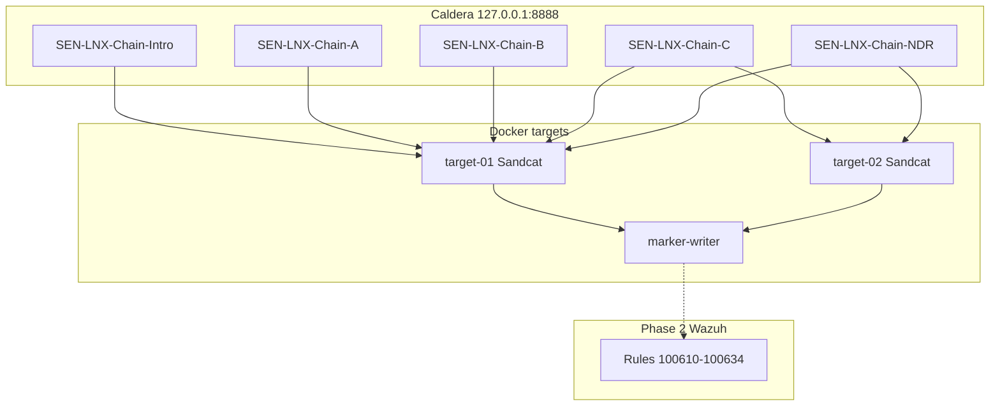
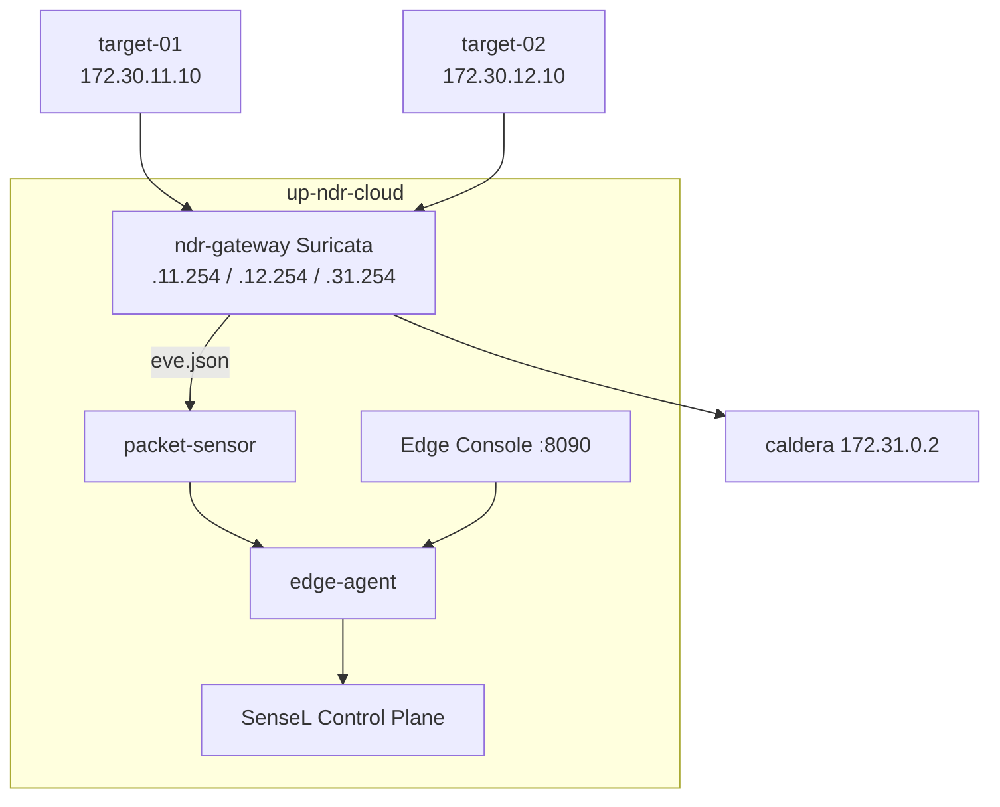

# SenseL Caldera Linux Lab — 教學指南 2.1

**Lab 代號：** castle-train-01  
**核心範圍：** Discovery · Collection · Archive · Simulated Exfil · Simulated Lateral（雙靶機）· **IT NDR（Suricata）**  
**僅限已授權、完全隔離的測試環境使用**

> 授權、隔離、可稽核的 **Caldera × Wazuh × Suricata NDR** 攻防演練教材。  
> 支援 **Docker 模擬部署**（macOS / Windows / Linux）與 **Ubuntu VM 正式 SPAN NDR**。

**PDF 匯出：** 本檔為 PDF 唯一原始來源，見 [`training/pdf/README.md`](pdf/README.md)。

---

## 目錄

1. [版本差異](#1-版本差異)
2. [安全邊界（必讀）](#2-安全邊界必讀)
3. [架構概覽](#3-架構概覽)
4. [部署模式（Docker vs Ubuntu VM）](#4-部署模式docker-vs-ubuntu-vm)
5. [全部 Abilities 對照表](#5-全部-abilities-對照表)
6. [訓練情境](#6-訓練情境)
7. [講師操作步驟（Caldera UI）](#7-講師操作步驟caldera-ui)
8. [Wazuh 關聯（Layer C — EDR）](#8-wazuh-關聯layer-c--edr)
9. [Suricata / NDR 關聯（Layer N）](#9-suricata--ndr-關聯layer-n)
10. [三層關聯（Caldera × Wazuh × Suricata）](#10-三層關聯caldera--wazuh--suricata)
11. [Edge Console 雲端註冊](#11-edge-console-雲端註冊)
12. [Cleanup](#12-cleanup)
13. [故障排除](#13-故障排除)
14. [建議教學順序](#14-建議教學順序)
15. [參考檔案](#15-參考檔案)

---

## 1. 版本差異

| 項目 | 2.0 | **2.1（本版）** |
|------|-----|-----------------|
| Abilities | 19（001～019） | 19（不變） |
| 訓練情境 | 4 條（Intro + A + B + C） | **5 條**（+ **NDR Chain**） |
| 靶機 | 2 台（Chain C） | 2 台（Chain C / NDR 共用） |
| 偵測層 | Wazuh EDR | Wazuh + **Suricata NDR（it_ndr）** |
| 關聯 | Layer C | **Layer C + Layer N + 三層 correlate** |
| 部署 | `make up` | `make up` / **`make up-ndr`** / **`make up-ndr-cloud`** |
| 平台 | 未明列 | **macOS · Windows Docker Desktop · Linux** |
| 正式 NDR | 無 | **Ubuntu VM + Portal bundle（SPAN）** |
| Suricata SID | 無 | **9000010～9000020（lab 規則）** |

較 1.0 / 早期 PDF：2.1 含完整 19 abilities、Chain C 雙靶機模擬橫向、NDR inline 閘道與雲端 Console。

---

## 2. 安全邊界（必讀）

本 lab **禁止**：

- 憑證竊取、持久化、提權、**真實**橫向移動（SSH pivot、遠端 exploit）
- 真實 outbound exfil、payload 下載、利用/反 shell
- 非 localhost 目標、privileged target 容器

**v2.1 仍屬「模擬」的項目：**

| 項目 | 說明 |
|------|------|
| **SEN-LNX-011 / 019（T1030）** | 僅 **本地 byte 計數**，`simulated: true`，無網路外傳 |
| **Chain C（SEN-APT29-LNX-04）** | 兩台 agent **各自**回連 Caldera；SEN-LNX-014 僅寫 `lateral-plan.json` |
| **SEN-LNX-013 ICMP** | lab 內 peer 探測，觸發 Suricata **9000020** |
| **NDR inline** | 僅 localhost Docker bridge；非生產 SPAN |
| **up-ndr-cloud** | 可連 SenseL Control Plane，仍限訓練 tenant / invite code |

---

## 3. 架構概覽

### 3.1 基礎 lab（`make up`）



### 3.2 NDR inline lab（`make up-ndr` / `make up-ndr-cloud`）



target ↔ caldera、target ↔ target 流量 **全部經 ndr-gateway** 轉發。

### 3.3 OT NDR vs IT NDR（講師速查）

| | OT NDR | **IT NDR（本 lab）** |
|---|--------|---------------------|
| Profile | `ot_ids` | **`it_ndr`** |
| 典型部署 | OpenWrt / OT SPAN | Docker inline（模擬）或 Ubuntu SPAN（正式） |
| 協定重點 | GOOSE/MMS/Modbus | HTTP C2、ICMP、Sandcat 下載 |

產品細節：[sensel-ot-edge-sensor](https://github.com/AvocadoAI-Lab/sensel-ot-edge-sensor)

---

## 4. 部署模式（Docker vs Ubuntu VM）

### 4.1 Docker 版 — Caldera 模擬與教學（macOS / Windows / Linux）

| 模式 | macOS / Linux | Windows |
|------|---------------|---------|
| 基礎 lab | `make up` | `.\scripts\windows\lab.ps1 up` |
| 本機 NDR | `make up-ndr` | `.\scripts\windows\lab.ps1 up-ndr` |
| NDR + 雲端 | `make up-ndr-cloud` | `.\scripts\windows\lab.ps1 up-ndr-cloud` |

**共通前置：**

```bash
cp .env.example .env
make validate
```

Windows 詳見：[docs/WINDOWS-DEPLOY.md](../docs/WINDOWS-DEPLOY.md)（需 Docker Desktop **Linux containers** + WSL2 + Git Bash）

| 服務 | URL |
|------|-----|
| Caldera UI | http://127.0.0.1:8888 |
| Edge Console（cloud） | http://127.0.0.1:8090 |

**適用：** 課堂 Caldera 演練、Suricata 告警示範、Portal invite smoke test。  
**不適用：** 正式 SPAN 被動抓包。

### 4.2 Ubuntu VM 版 — 正式 IT NDR（SPAN）

```bash
python3 -m zipfile -e sensel-it-ndr-*.zip sensel-deploy
cd sensel-deploy && chmod +x install.sh
# 編輯 .env：SENSOR_ID、OT_REGISTRATION_TOKEN
./install.sh
# Edge Console: http://<vm-ip>:8090
```

或：

```bash
cp /path/to/portal-bundle/.env ndr/portal.env
SENSEL_NDR_BUNDLE_DIR=/path/to/portal-bundle bash scripts/setup-ndr-edge.sh
```

**注意：** Ubuntu SPAN 與 Docker inline lab **預設流量路徑不同**；Portal 不會自動看到 Caldera 流量，除非另行 mirror。

---

## 5. 全部 Abilities 對照表

| ID | 名稱 | ATT&CK | Tactic | Wazuh Rule |
|----|------|--------|--------|------------|
| SEN-LNX-001 | Local Account Discovery | T1087.001 | Discovery | 100610 |
| SEN-LNX-002 | Network Configuration Discovery | T1016 | Discovery | 100611 |
| SEN-LNX-003 | Process Discovery | T1057 | Discovery | 100612 |
| SEN-LNX-004 | Synthetic Data Staging | T1074.001 | Collection | 100613 |
| SEN-LNX-005 | System Information Discovery | T1082 | Discovery | 100614 |
| SEN-LNX-006 | File and Directory Discovery | T1083 | Discovery | 100615 |
| SEN-LNX-007 | Archive Staged Collection | T1560.001 | Collection | 100616 |
| SEN-LNX-008 | System Owner/User Discovery | T1033 | Discovery | 100617 |
| SEN-LNX-009 | System Service Discovery | T1007 | Discovery | 100618 |
| SEN-LNX-010 | Automated Collection | T1119 | Collection | 100619 |
| SEN-LNX-011 | Simulated Exfil Size Check | T1030 | Exfiltration* | 100620 |
| SEN-LNX-012 | Remote System Discovery | T1018 | Discovery | 100627 |
| SEN-LNX-013 | Remote Service Discovery | T1046 | Discovery | 100628 |
| SEN-LNX-014 | Simulated Lateral Plan | T1018 | Discovery* | 100629 |
| SEN-LNX-015 | Tier2 System Information Discovery | T1082 | Discovery | 100630 |
| SEN-LNX-016 | Tier2 File and Directory Discovery | T1083 | Discovery | 100631 |
| SEN-LNX-017 | Tier2 Synthetic Data Staging | T1074.001 | Collection | 100632 |
| SEN-LNX-018 | Tier2 Archive Staged Collection | T1560.001 | Collection | 100633 |
| SEN-LNX-019 | Tier2 Simulated Exfil Size Check | T1030 | Exfiltration* | 100634 |

\*T1030 為 **模擬**；SEN-LNX-014 為 **模擬橫移計畫**，非真實 lateral movement。

---

## 6. 訓練情境

### 6.1 Intro — `SEN-APT29-LNX-01`（4 步，入門）

**Profile：** `SEN-LNX-Chain-Intro`

| 步驟 | Ability | 說明 |
|------|---------|------|
| 1 | SEN-LNX-001 | 本地帳號列舉 |
| 2 | SEN-LNX-002 | 網路設定 |
| 3 | SEN-LNX-003 | 程序列表 |
| 4 | SEN-LNX-004 | Synthetic staging + manifest |

```bash
python3 scripts/trainingctl.py run-manual --scenario SEN-APT29-LNX-01
```

---

### 6.2 Chain A — `SEN-APT29-LNX-02`（6 步）

**Profile：** `SEN-LNX-Chain-A`

| 步驟 | Ability | ATT&CK |
|------|---------|--------|
| 1 | SEN-LNX-001 | T1087.001 |
| 2 | SEN-LNX-002 | T1016 |
| 3 | SEN-LNX-005 | T1082 |
| 4 | SEN-LNX-006 | T1083 |
| 5 | SEN-LNX-004 | T1074.001 |
| 6 | SEN-LNX-007 | T1560.001 |

Artifact：`/tmp/sensel-discovery-00{1,2,5,6}.txt`、`manifest.json`、`sensel-staging.tar.gz`

```bash
python3 scripts/trainingctl.py run-manual --scenario SEN-APT29-LNX-02
```

---

### 6.3 Chain B — `SEN-APT29-LNX-03`（6 步）

**Profile：** `SEN-LNX-Chain-B`

| 步驟 | Ability | ATT&CK |
|------|---------|--------|
| 1 | SEN-LNX-003 | T1057 |
| 2 | SEN-LNX-008 | T1033 |
| 3 | SEN-LNX-009 | T1007 |
| 4 | SEN-LNX-010 | T1119 |
| 5 | SEN-LNX-004 | T1074.001 |
| 6 | SEN-LNX-011 | T1030（simulated） |

```bash
python3 scripts/trainingctl.py run-manual --scenario SEN-APT29-LNX-03
```

---

### 6.4 Chain C — `SEN-APT29-LNX-04`（8 步，模擬橫向·雙靶機）

**Profile：** `SEN-LNX-Chain-C`  
**部署：** `make up`（不需 NDR）

| 步 | Ability | 主機 | ATT&CK |
|----|---------|------|--------|
| 1 | SEN-LNX-012 | target-01 | T1018 |
| 2 | SEN-LNX-013 | target-01 | T1046 |
| 3 | SEN-LNX-014 | target-01 | T1018（simulated plan） |
| 4 | SEN-LNX-015 | target-02 | T1082 |
| 5 | SEN-LNX-016 | target-02 | T1083 |
| 6 | SEN-LNX-017 | target-02 | T1074.001 |
| 7 | SEN-LNX-018 | target-02 | T1560.001 |
| 8 | SEN-LNX-019 | target-02 | T1030（simulated） |

**Caldera Operation：** 勾選 **兩個 agent**（`caldera-linux-target-01` 與 `-02`），Group `castle-train-01`，Autonomous ON。

```bash
python3 scripts/trainingctl.py run-manual --scenario SEN-APT29-LNX-04
```

---

### 6.5 NDR Chain — `SEN-NDR-LNX-01`（5 步）**【2.1 新增】**

**Profile：** `SEN-LNX-Chain-NDR`  
**部署：** `make up-ndr` 或 `make up-ndr-cloud`

| 步 | Ability | 主機 | Wazuh | Suricata |
|----|---------|------|-------|----------|
| 1 | SEN-LNX-012 | target-01 | 100627 | ~9000010（背景 C2） |
| 2 | SEN-LNX-013 | target-01 | 100628 | **✓ 9000020（ICMP）** |
| 3 | SEN-LNX-014 | target-01 | 100629 | ~9000010 |
| 4 | SEN-LNX-017 | target-02 | 100632 | △9000010/9000012 |
| 5 | SEN-LNX-019 | target-02 | 100634 | △9000010/9000012 |

符號：✓ 專屬 · ~ 背景 · △ 可能 · − 無專屬

Wazuh **每步 1:1**；Suricata **非**每步 1:1（Step 2 為硬性專屬 ICMP）。

```bash
make up-ndr
python3 scripts/trainingctl.py run-manual --scenario SEN-NDR-LNX-01
docker exec ndr-gateway tail -f /var/log/suricata/eve.json
```

---

## 7. 講師操作步驟（Caldera UI）

### 7.1 環境準備

**Intro / A / B / C：**

```bash
make up && make status
```

**NDR 情境：**

```bash
# macOS / Linux
make up-ndr-cloud && make status-ndr-cloud

# Windows
.\scripts\windows\lab.ps1 up-ndr-cloud
```

### 7.2 建立 Adversary Profile

1. Campaigns → Adversary Profiles → + New Profile  
2. 依 §6 使用建議 profile 名稱  
3. **依序** 加入 abilities  
4. 儲存  

### 7.3 啟動 Operation

| 設定 | 正確 | 錯誤 |
|------|------|------|
| Adversary | 具名 profile（如 `SEN-LNX-Chain-C`） | ad-hoc 空 profile |
| Agent | 1 台（Intro～B）或 **2 台**（C / NDR） | 離線或漏選 target-02 |
| Group | `castle-train-01` | 空白 |
| Autonomous | ON | OFF 需手動逐步 |

### 7.4 驗證成功

- Operation chain 步數正確（4 / 6 / 8 / 5）  
- 每步 success  
- marker log 有 NDJSON  

```bash
docker compose exec target-linux tail -5 /var/log/sensel-training/caldera-events.json
docker compose exec target-linux-02 tail -5 /var/log/sensel-training/caldera-events.json
```

**NDR 加項：**

- `ndr-gateway` healthy  
- Step 2 後 `eve.json` 出現 SID **9000020**  
- cloud 模式：Portal 見 sensor（8090 完成 invite）

---

## 8. Wazuh 關聯（Layer C — EDR）

### 8.1 規則部署

部署 [`wazuh/manager/local_rules.xml`](../wazuh/manager/local_rules.xml) 至 soc-sensel Manager。

```bash
make wazuh-test
make test
```

### 8.2 關聯指令

```bash
python3 scripts/trainingctl.py correlate \
  --scenario SEN-APT29-LNX-04 \
  --operation-report /path/to/operation-report.json \
  --wazuh-alerts fixtures/wazuh-alerts-chain-c.ndjson
```

關聯鍵：`tenant_id` + `hostname` + `scenario_id` + 時間窗口。

---

## 9. Suricata / NDR 關聯（Layer N）

### 9.1 Lab Suricata 規則

| SID | 觸發 |
|-----|------|
| 9000010 | Caldera C2 HTTP `/beacon` |
| 9000011 | Sandcat `POST /file/download` |
| 9000012 | 大型 C2 HTTP 上傳 |
| 9000020 | ICMP peer 探測（SEN-LNX-013） |

規則：`ndr/suricata/rules/sensel-caldera.rules`

### 9.2 即時查看

```bash
docker exec ndr-gateway tail -f /var/log/suricata/eve.json
```

---

## 10. 三層關聯（Caldera × Wazuh × Suricata）

```bash
python3 scripts/trainingctl.py correlate \
  --scenario SEN-NDR-LNX-01 \
  --operation-report /path/to/operation-report.json \
  --wazuh-alerts fixtures/wazuh-alerts-ndr.ndjson \
  --suricata-alerts fixtures/suricata-alerts-ndr.ndjson
```

輸出：

- `reports/SEN-NDR-LNX-01-correlation.json`  
- `reports/SEN-NDR-LNX-01-summary.md`  

---

## 11. Edge Console 雲端註冊

1. 複製 Portal bundle `.env` → `ndr/portal.env`（或填 `.env` 中 `MQTT_TENANT_ID`、`SENSOR_ID`）  
2. `make up-ndr-cloud`（Windows：`lab.ps1 up-ndr-cloud`）  
3. http://127.0.0.1:8090 → Setup wizard → 貼 **invite code**  
4. Portal 確認 sensor online  

`make up-ndr`（無 cloud）**不會**出現在 Portal。

---

## 12. Cleanup

```bash
python3 scripts/trainingctl.py cleanup
make down-ndr-cloud
```

---

## 13. 故障排除

| 現象 | 原因 | 處理 |
|------|------|------|
| Ability 在 UI 消失 | YAML 路徑或 plugin 未載入 | `make test`；重啟 caldera |
| Operation chain=0 | ad-hoc 空 profile | 選具名 adversary |
| Chain C 只成功一半 | 只選一個 agent | 勾選 target-01 **與** target-02 |
| NDR 無告警 | 未 `up-ndr` | `make status-ndr` |
| 無 SID 9000020 | 流量未走 NDR | 確認 ndr-gateway healthy |
| Portal 無 sensor | 僅 `up-ndr` | 改 `up-ndr-cloud` + 8090 |
| Windows bash 錯誤 | 無 Git Bash | 見 WINDOWS-DEPLOY.md |
| SEN-LNX-010 失敗 | Chain B 順序錯 | 003/008/009 須在前 |

---

## 14. 建議教學順序

| 堂次 | 內容 | 部署 |
|------|------|------|
| 1 | Intro（4 步） | `make up` |
| 2 | Chain A（6 步） | `make up` |
| 3 | Chain B（6 步） | `make up` |
| 4 | Chain C（8 步·雙靶機） | `make up` |
| 5 | NDR Chain（5 步） | `make up-ndr` |
| 6 | 三層關聯 + SOC 時間線 | `make up-ndr` |
| 7 | （選修）Portal 雲端註冊 | `make up-ndr-cloud` |

---

## 15. 參考檔案

| 路徑 | 用途 |
|------|------|
| `training/scenarios/SEN-APT29-LNX-0*.yaml` | Intro / A / B / C |
| `training/scenarios/SEN-NDR-LNX-01-*.yaml` | NDR 情境 |
| `compose.ndr.yml` / `compose.ndr.cloud.yml` | NDR overlay |
| `ndr/suricata/rules/sensel-caldera.rules` | Lab SID |
| `fixtures/suricata-alerts-ndr.ndjson` | NDR 關聯測試 |
| `docs/WINDOWS-DEPLOY.md` | Windows 部署 |
| `scripts/windows/lab.ps1` | Windows PowerShell |
| `ndr/portal.env.example` | Portal / 雲端變數 |
| `scripts/trainingctl.py` | validate / run-manual / correlate |

---

*SenseL Caldera Linux Lab Training Guide v2.1 — castle-train-01*
